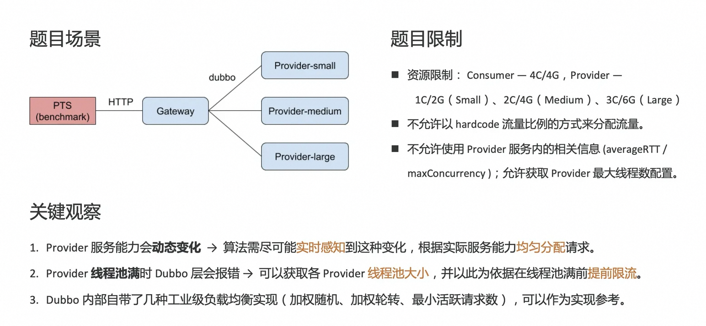
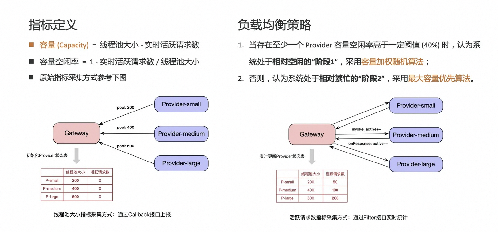
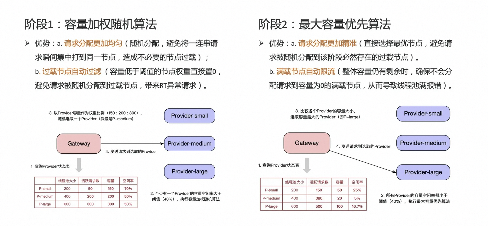

# Adaptive Load Balance

> 赛事介绍：[第五届中间件性能挑战赛_程序设计大赛_天池大赛](https://tianchi.aliyun.com/competition/entrance/231714)
> 
> 赛题介绍：[阿里巴巴2019中间件性能挑战赛-自适应负载均衡（初赛）赛题](CONTEST.md)

## 赛题背景分析及理解

### 功能需求

实现一套自适应负载均衡机制，作为扩展作用于 gateway 和 provider 两端，要求能够具备以下能力：  

1. Gateway（Consumer）端能够自动根据服务处理能力变化动态最优化分配请求保证较低响应时间，较高吞吐量。  
2. Provider 端能自动进行服务容量评估，当请求数量超过服务能力时，允许拒绝部分请求，以保证服务不过载。  
3. 当请求速率高于所有的 Provider 服务效率之和时，允许 Gateway（Consumer）拒绝服务新到请求。

### 评测方式

每个 Provider 的服务能力（处理请求的速率）都会不定期变化：  

- 三个 Provider 的总处理能力会分别在小于/约等于/大于请求量三个状态变动；  
- 任意一个 Provider 的单机处理能力都小于总请求量。

PTS 以固定连接数（1024）向 Gateway 发送请求，按照 PTS 统计的成功请求数和最大 TPS 作为排名依据。

### 题目限制

- 资源限制：Consumer - 4c4g，Provider - 1c2g（small）、2c4g（medium）、3c6g（large）。
- 不允许使用 Provider 服务内的相关信息，如配置的 averageRTT/ maxConcurrency 等, 允许自行统计和计算。
- 需要提供通用的算法实现，不允许以 hardcode 流量比例的方式来分配流量。
- 允许获取 Provider 的最大线程数配置，并作为限流值（参见FAQ）。

### 关键观察

- Provider 服务能力会动态变化 （通过内部的最大并发数信号量和延迟模拟时间控制）；
  - → 算法需尽可能**实时感知**到这种变化，根据实际服务能力**均匀分配**请求。
- Provider 端的请求处理线程池大小是固定不变的，如果线程池满会直接报错，影响成功请求吞吐率；
  - → 可以获取各 Provider **线程池大小**，并以此为依据在线程池满前**提前限流**。
- Dubbo 内部自带了几种工业级负载均衡实现（加权随机、加权轮转、最小活跃请求数）；
  - → 可以作为实现参考（造更好的轮子之前，你得先理解现在的轮子是怎么转的）。

## 核心思路：两阶段混合负载均衡

既然是“自适应”的算法，就必定会需要实时监测系统某些指标，相应调整流量分配策略。这里先给出我的**指标定义**：

- **容量 (Capacity)** = 线程池大小 - 实时活跃请求数
- **容量空闲率** = 1 - 实时活跃请求数 / 线程池大小 n

用于计算上述指标的**原始指标**，可以用如下方式采集：

- **线程池大小**：基于 Provider 端的 Callback 机制，在应用启动阶段推送 Provider 线程池大小（从 Dubbo 的全局 dataStore 获取）到 Consumer 端。
- **活跃请求数**：基于 Consumer 端 Filter 机制，为每个 Provider 维护一个实时活跃请求数原子计数器，在请求发出前（invoke）递增计数器，收到响应时（onResponse）递减计数器。

有了上述指标的实时监测能力，接下来就可以实施如下**负载均衡策略**：

1. 当存在至少一个 Provider 容量空闲率高于一定阈值 (40%) 时，认为系统处于**相对空闲**的“阶段1”，采用**容量加权随机**算法;  
2. 否则，认为系统处于**相对繁忙**的“阶段2”，采用**最大容量优先**算法。

**阶段1：容量加权随机算法**

- **流程**：
  - 以 Provider 容量为节点权重，在容量高于空闲率阈值的所有 Provider 节点中（低于阈值的节点权重会被设置为0），按照权重比例随机分配调度节点。
- **优势**：
  - **请求分配更加均匀**：随机分配，避免将一连串请求瞬间集中打到同一节点，造成不必要的节点过载。
  - **过载节点自动过滤**：(容量低于阈值的节点权重直接置0，避免请求被随机分配到过载节点，带来RT异常请求。

**阶段2：最大容量优先算法**

- **流程**：
  - 直接选取当前所有 Provider 节点中容量最大的 Provider，作为请求目标节点。
- **优势**：
  - **请求分配更加精准**：直接选择最优节点，避免请求被随机分配到该阶段必然存在的过载节点。
  - **满载节点自动限流**：整体容量仍有剩余时，确保不会分配请求到容量为0的满载节点，从而导致线程池满报错。

**P.S.** 代码有点乱，没整理过... 不过这道题实现没太多新奇的地方，[复赛题目](https://github.com/pengqun/mqrace2019) 更有意思点。
